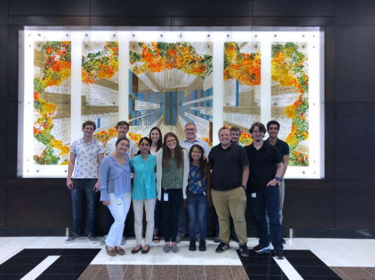

# web-apps-mod1

## Repository Links

-Repo Link
-Hosted Page Link

## About
This repo will be used as a place for me to practice my markdown skiils, and complete the moduel that is due today. I will also be storing my intrduction to the glass in the index.md file for future use.

## Recommended Tools
Web Development and the rest of computer sceince are vast fields with an uncountale amount of tools, so I will just share with you my preferences for the basics.

- For a browser I prefer
 [Google Chrome](https://www.google.com/chrome/)

- For a editor I prefer
[Visual Studio Code](https://code.visualstudio.com/)

- And for version control, I obivously prefer
[Github](https://www.github.com)

## Contributors
My name is Dylan Rongey, I am computer science major, and here's the best photo I could find on my desktop!

